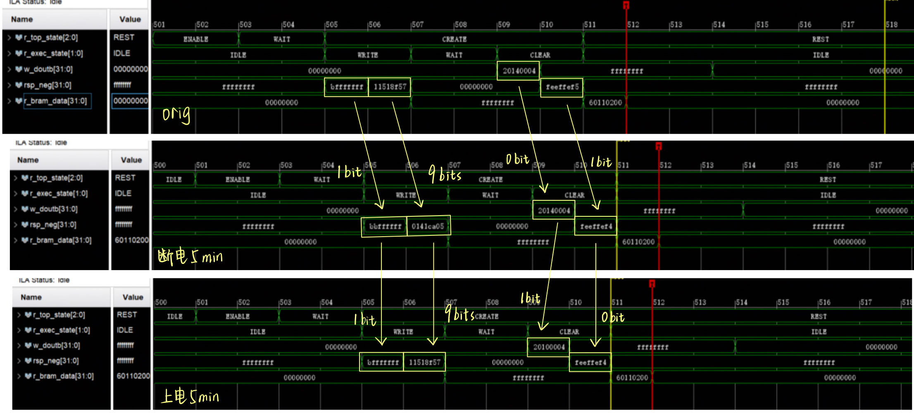

# RTL Source Log: Debug and Plan

FPGA Evaluation Board: Xilinx VC707  
Global clock: 350MHz | ILA Sample Clock: 700MHz  
BRAM Address: 10'h00_0000_0000  

---

## Daily Log

- [7.25: Bram Behavior](#725-bram-behavior-analysis---keep-prot-a-always-write-enable)
- [7.24: FSM Update](#724-update-fsm--data-remaining-time-test)

---

## Current Task

- [ ] Take the sequence in which random numbers appear steadily, compute bit rate.
- [ ] Register TRNG quality? Is it caused by sequence conflict?
- [ ] Cut down the period between robustness test, observe its behavior. 

---

### 7.26: Bit Rate Test

---

### 7.25: Bram Behavior Analysis - Keep Prot A always write enable

Register written on Positive Edge

Register written on Negative Edge

#### Potential Problem
- Global_clk and ILA_clk just satisfy **sample principle**. (Robustness? Data Correctness?)
- **Model robustness is weak**, random data can occur or disappear just by small change (like ILA wiring).

#### Discovery

##### Timing
- BRAM: **1-1.5cycle** to produce random data
- Reg: **1.5 Cycle** to read random data  
  
    yellow: sometimes would be stable value  
    blue: random value always occur

##### Data robustness
1. Keep power, immediate repeat: small change (temperature: around 31.8 degrees)
1. Cut off power, 5-min repeat: significant change (temperature: around 31.8 degrees)
1. Keep power, 5-min repeat: similar to original value and condition 1 (temperature: around 32.8 degrees)  

##### Others
- **Register** can produce random data
- Single bit can jump repeatedly within one challenge

#### Ideas for next step
- Try register TRNG/PUF
- Clone project to Pango Evaluation Board
- Get mutiple data and analyze (test ECC code, etc.)

---

### 7.24: Update FSM & Data Remaining Time Test

Chaotic Sequential FSM

State Updated FSM: w_doutb continuous detection

#### Problem Unsolved
- Not prefect random
- 1.5 cycle behavior doesn't match: neg edge stable，pos edge random
- ILA influence FSM: Cause chaotic sequential

#### TO DO
- [ ] Change Bram ADDR
- [x] Keep write enable, change dina