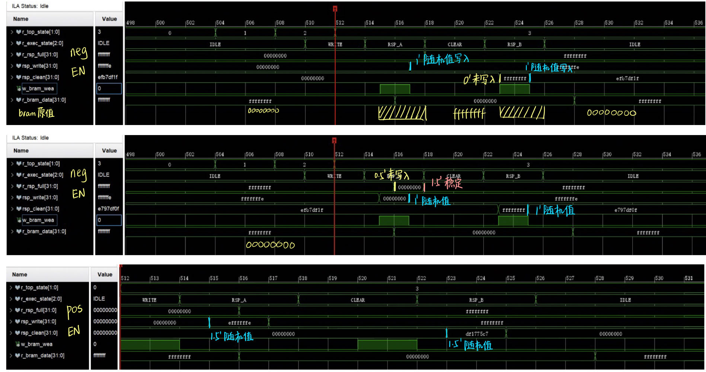

# RTL Source Log: Debug and Plan

## 7.24: Update FSM & Data Remaining Time Test

**Problem Unsolved:**
- 首次执行，未reset条件下，WRITE缺少一次0.5周期赋值
- 时序优化FSM随机性小于混乱版
- 1.5 cycle表现不一致，neg edge稳定，pos edge随机
- ILA探针会影响观测结果: 外层检测导致状态机混乱跳转

==To Do==
- 更改地址观测结果
- 始终保持写使能(wea),更改dina，观测结果